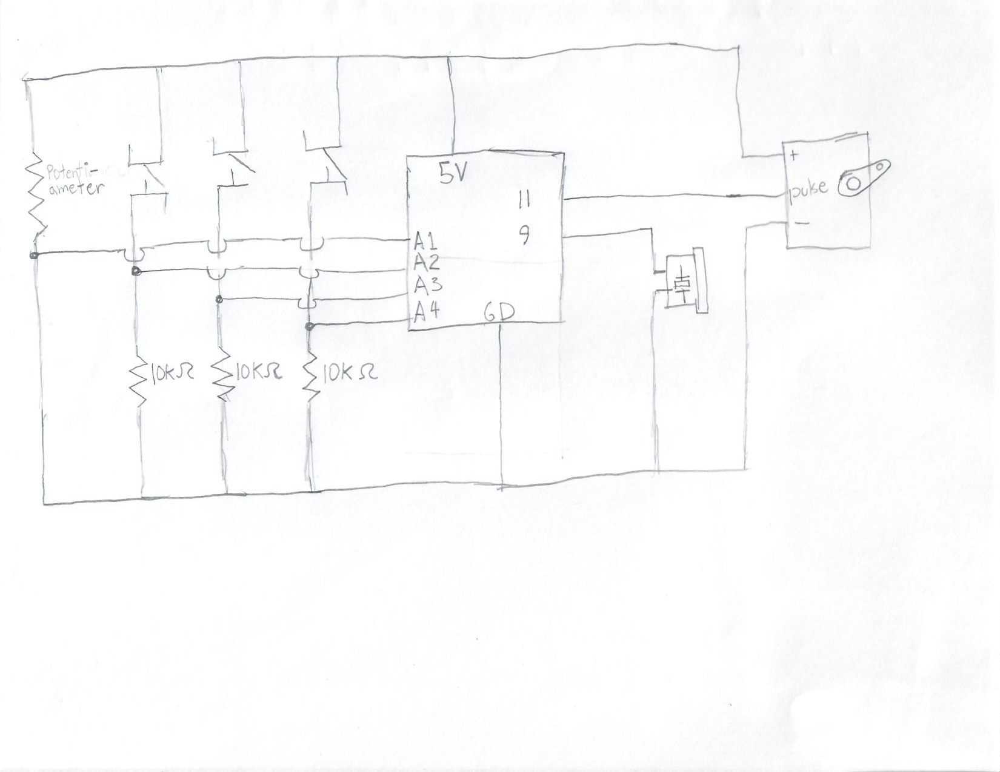

My project uses three buttons and a potentiometer to make music using a servo motor and a piezo buzzer. One of the buttons is used to control the servo. This button rotates it 90 and back. The servo motor has a stick attached which makes a noise when it hits an object, like a drum. The other two buttons are used to play notes with the piezo buzzer, with the potentiometer giving control on what those notes are.

The trickiest thing in the project was to play the music without using delay. I used state booleans that would tell me if I was playing a note at the time so that I didn't refresh the playing with a new note.

Here is a picture of my schematic:

Here is a youtube link to the video: https://www.youtube.com/watch?v=ghKSseJq83E

Pictures of the instrument/electronics:

