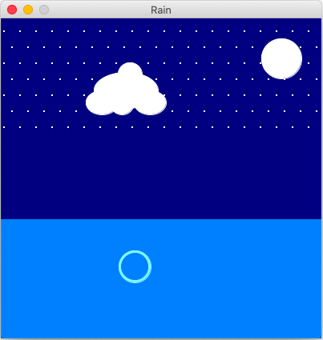

Picture of Rain

My program creates rain when you click. The rain falling is a function that translates a droplet downward. Once the drop reaches a certain point my program calls the ripple function. This function creates a expanding ring, which is basically two circles.

One of the difficulties was to animate the droplet so it would move. Using a for loop would just show the end result. Instead I used booleans in the draw function to tell me when it was raining and when it was rippling. I could not use the scale transformation to increase ripple size because it would also move the ripple downward.

I discovered the mousepress boolean.
