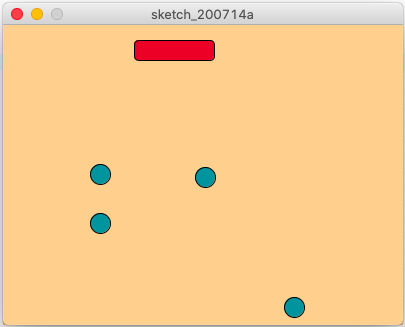

Picture of Rain

My game is based on ice hockey. You control the puck and try to hit a ball. The difficulty increases the longer you play. I add up to four balls, one every 10 seconds, and the balls increase in speed.

I use a class for the balls and hold them in an array with variables like speed, location, and direction. The puck follows the players mouse. One of the difficulties was to check if the balls hit the puck. My final program just checks if the balls are above a certain location and in the x coordinates of the puck. This is not the best solution but was the only one I could come up with.
