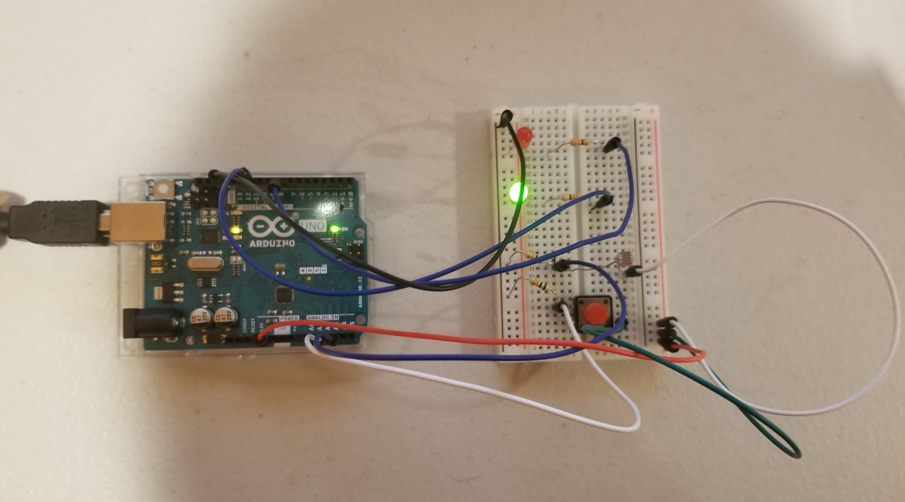

Picture of Schematics

Picture of Board

My circuit contains a photoresister, switch, and two LEDs. The photoresister is pretty simple. When it detects a lot of light the LED's light is low, but if it detects less light the LED's light will be stronger. This was mainly achieved using the map function to reverse the trend and change the values from the range of 0-1200 to the range of 255-0. The digital input, the switch was harder. Whenever you click it, the LED blinks three times each for half a second. This is where I had some trouble because I was trying to use the Blink without delay idea. However I figured it out and it works now.
