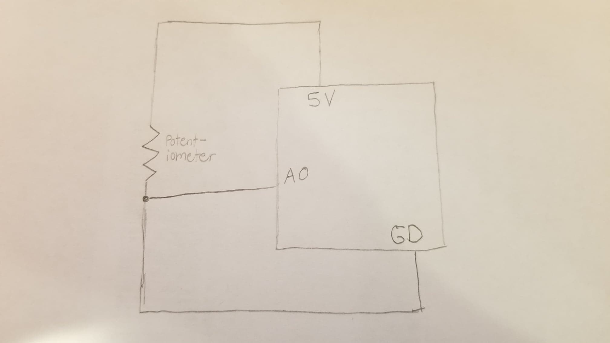
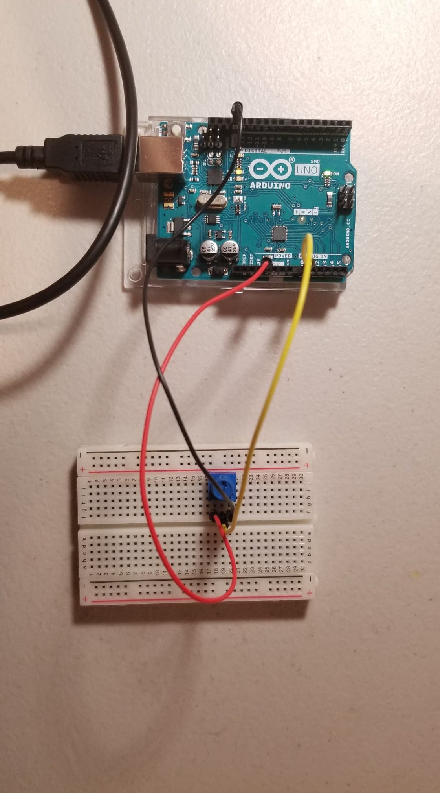

This is the description from my midterm:
My game is based on air hockey. You control the puck and try to hit a ball. The difficulty increases the longer you play. I add up to four balls, one every 7 seconds. The goal of the game is to survive and hit all the multicolored blocks at the bottom.

I use a class for the balls and hold them in an array with variables like speed, location, and direction. The boxes also have a simple class holding color, if they exist, and location. The puck follows the players mouse. Every time a ball moves, I check if it hit the boxes or the puck. For both of those I have different sounds. However I do not have a sound if the ball hits a wall because I didn't want a wall of sound. Once all the pucks are gone or the player lost, I wait till they click to restart the game. For restarting I basically just redefine the ball and box locations. One of the difficulties was to check if the balls hit the puck. My final program just checks if the balls are above a certain location and in the x coordinates of the puck. This is not the best solution but was the only one I could come up with. Another problem was showing the instructions only at the start. To solve this, I kept a global boolean variable that would make sure that code only ran once.

What I added:
I added a speed variable to the ball class that controls how fast the balls will move. The potentiometer is used to control the speed.

Here is a picture of my schematic:

Here is a picure of my electronics:

