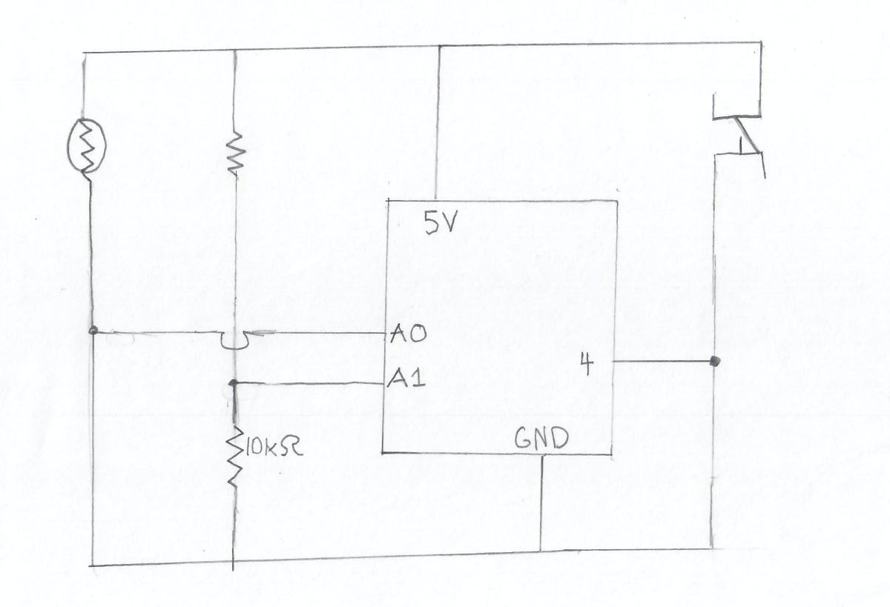
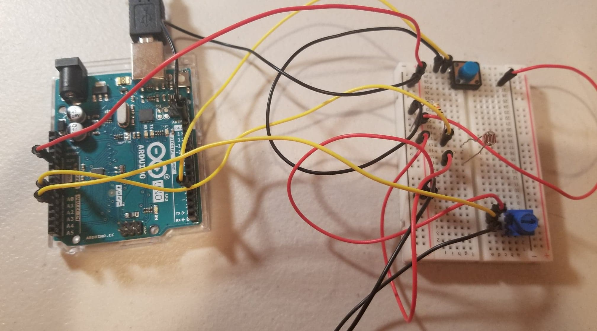

My project is a game where you control the growth of a tree. Your goal is to catch as many birds as you can before

you reach the top using your two controls, a potentiometer and photoresister. The potentiometer control your angle

of growth, while the photoresistor controls your speed.

Here is a quick picture:

One of the problems I faced was that I wanted to animate the moving birds without erasing the tree. My final solution

was to save the coordinates of the tree, and redraw it every frame.

Here is my schematic:

And here is a picture of my electronics:

A link to my video on youtube:

https://www.youtube.com/watch?v=QloW-mHUXdE
