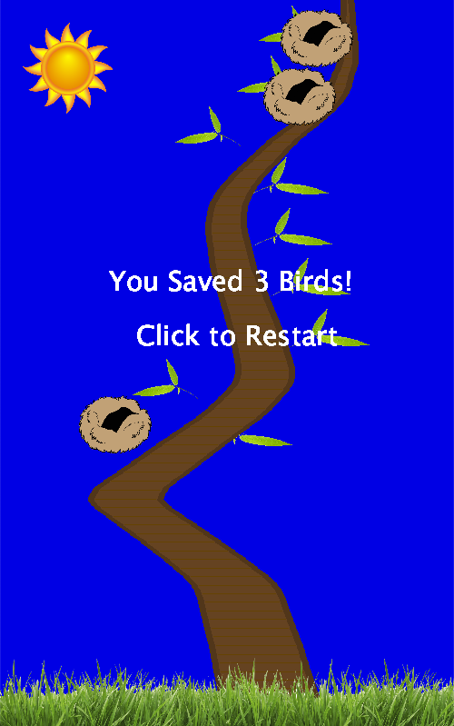

My project is a game where you control the growth of a tree. Your goal is to catch as many birds as you can before

you reach the top using your two controls, a potentiometer and photoresister. The potentiometer control your angle

of growth, while the photoresistor controls your speed.

Here is a quick picture:

One of the problems I faced was that I wanted to animate the moving birds without erasing the tree. My final solution

was to continue refreshing the whole screen, but also redraw the tree.

Here is my schematic:

And here is a picture of my electronics:

